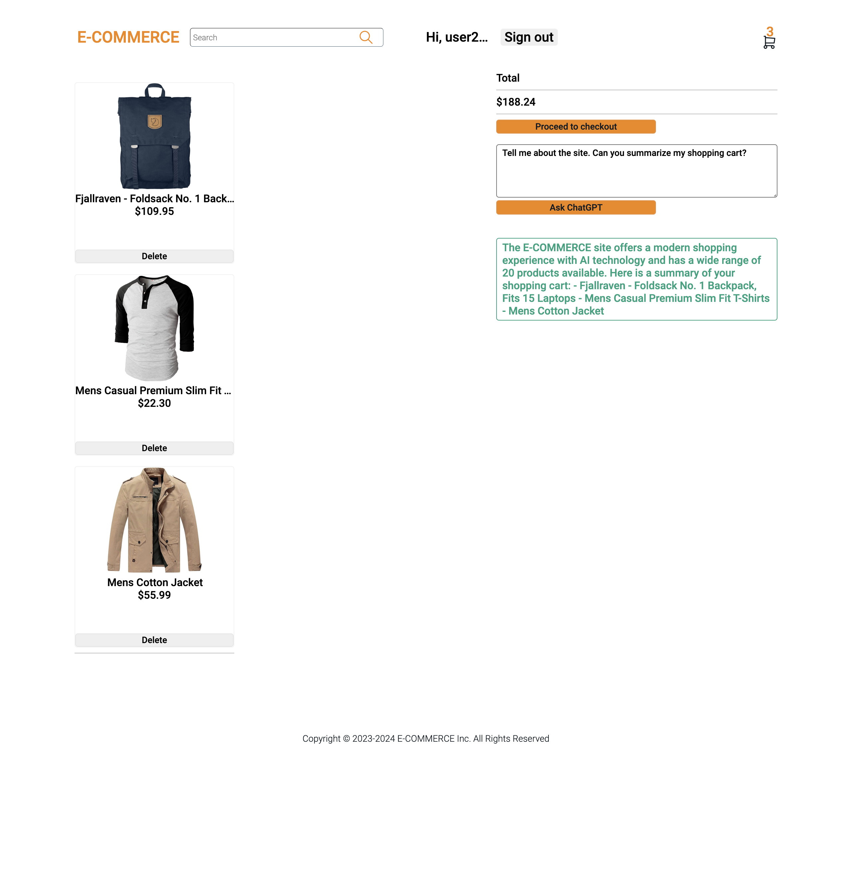

# E-COMMERCE

## Overview

E-COMMERCE is a dynamic, responsive, and AI powered e-commerce website built on React in the font end and Express in the back end. This website offers users a modern online shopping experience.

## Project Screenshots

### Problem

This site is created for my personal use in phase one. In phase two, when more features are added, this site will allow users to see product wirh AI recommendations and more functionalities to allow users to navigate the web content because: 

many users currently face challenges when shopping online such as a lack of personalized recommendations, and difficulty navigating through extensive product catalogs. In phase three, the site should allow users to sell products by enabling sell features and user profile page.

### User Profile

The website targets diverse users due to its responsiveness:
- General shoppers
- Mobile/tablet users
- desktop users
Users can go to the website, browse the website, and select the items that they want to purchase

### Features

1. User registration: new users can create an account by providing a username,email, and password

2. User auth: registered users can log in to their accounts with JWT authentication

3. Product browsing: users can browse products easily. Filter by categories etc.

4. Product search: search a specific product by entering keywords to retrieve what they are looking for to purchase

5. Shopping cart: users can add products to the shopping cart for checkout

6. Payment: users can checkout their products by entering payment methods

7. Responsive design: the website works from between different devices providing a seamless user experience

8. Product recommendation: recommend products to registered user (will be added in development phase 2)

9. Website summary: providing a summary to users with website products, reviews, ratings, etc (will be added in development phase 2).

## Implementation

- VS Code, Chrome Web Dev tools

### Tech Stack

- Font end: HTML, Sass
- Frameworks and Libraries: React, Axios, Knex
- Back end: Node, Express, MySQL database

### APIs

- Own API with routes
- Fake Store API
- Stripe/Paypal API
- OpenAI API

### Sitemap

- Homepage: displays a list of products, category list, user login/sign-up buttons
- Product details page: displays details of a selected product and 
- Sign up/ login page: allows user to sign up/log in
- Logout page
- User profile page: after users log in or sign up, displays user profile
- log out page: displays a page when user log out from their accounts
- Checkout page: allows users to make a payment
- Error page
- Loading page

### Mockups

### Data

MySQL database

### Endpoints

### Auth

Auth in the first phase should be just a simple check when a user creates an account. It will check if users enter all required fields.

Local/section storage and JWT token authentication will be implemented in phase 1 of development 

## Roadmap

1. Github repo setups: client and server
2. Design a simplified version of phase one database schema in the back end 
3. Test web apis data for this project
4. Test Express server routes and my API endpoint requests wirh server
5. Test Client react routes 
6. Implement basic features for client pages 
7. Styling

## Installation
git clone git@github.com:manyprojects/e-commerce-client.git

this project requires server api to run:

git clone git@github.com:manyprojects/e-commerce-server.git

### Change into the project directory
cd to the corresponding client and server directory

### Install dependencies
npm i axios dotenv react-router-dom react-dom sass

### Start the development
npm start

